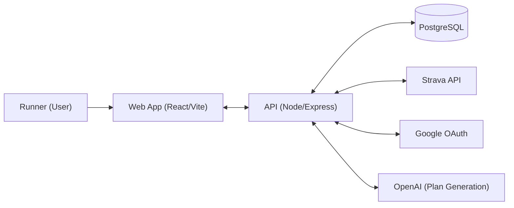
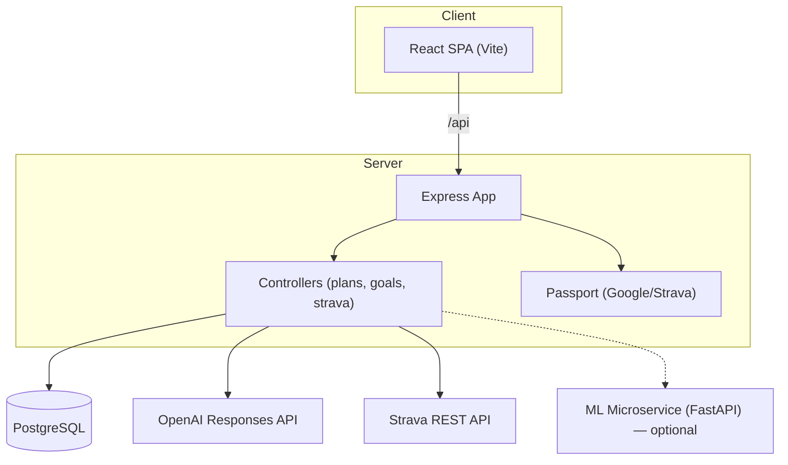
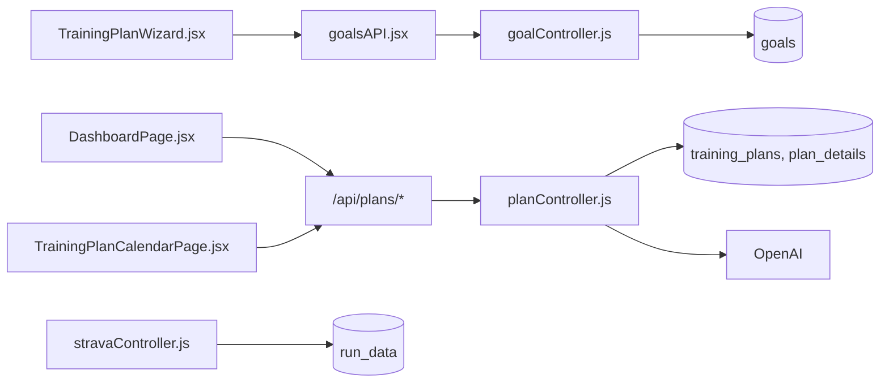
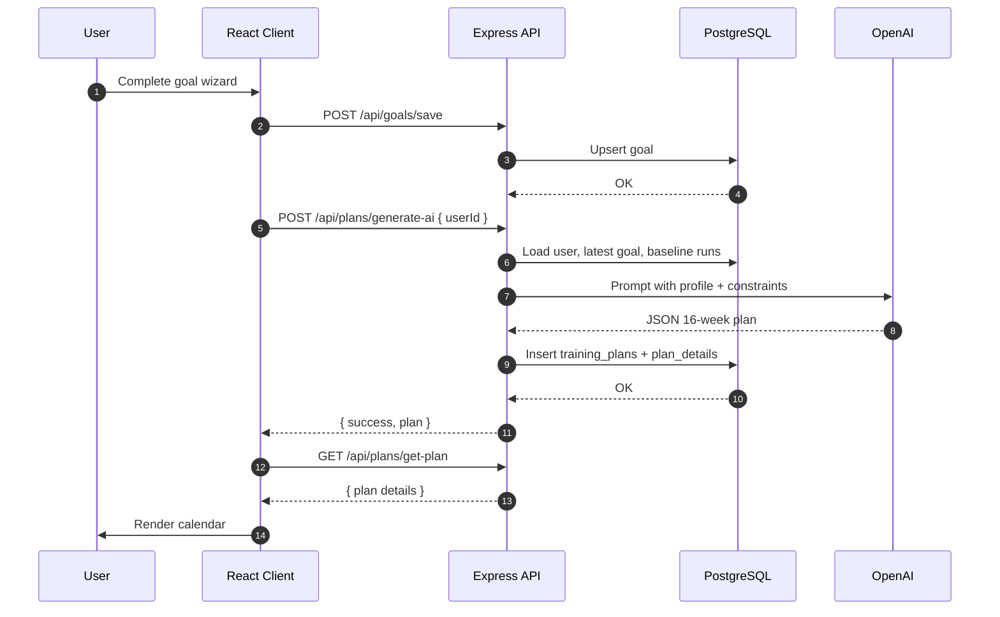
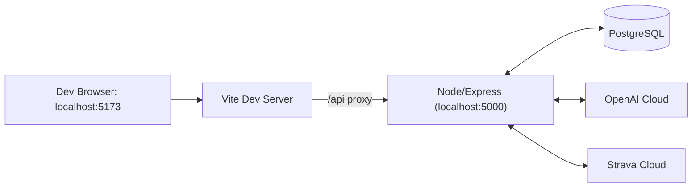

## AI Personalized Running Coach — Architecture Guide

### Overview

An AI-powered training companion that analyzes historical running, understands user goals, and generates a personalized 16‑week periodized plan. The app integrates with Strava for activity ingestion, stores data in PostgreSQL, uses OpenAI to craft training plans, and serves a modern React/Vite UI.

- **Purpose**: Help runners set realistic goals and follow a tailored, data-driven plan.
- **Key Capabilities**:
  - Goal capture: distance, target time, preferred run days, weekly volume.
  - Strava ingestion: runs (distance, pace, cadence, HR) with weekly aggregations.
  - AI plan generation: 16‑week progressive load with deload weeks.
  - Plan storage & calendar visualization.
  - Dashboard: recent activity and trend stats.
- **High-level flow**: React SPA → Node/Express API → PostgreSQL; integrated with Google OAuth, Strava, and OpenAI.

---

### Architecture Pipeline

End-to-end workflow, from data intake to user-facing presentation:

1) Goal capture (client)
- Multi-step wizard collects distance, target time, preferred days, and weekly km.
- Client calls `POST /api/goals/save` to persist a goal for the current user.

2) Plan generation (server ↔ AI)
- Client triggers `POST /api/plans/generate-ai` with `userId`.
- Server builds a system prompt using:
  - Profile: `users.username`.
  - Most recent goal: `goals`.
  - Baseline metrics: last 8 runs from `run_data` (fallback to a demo Strava user if none).
- Server calls OpenAI (Responses API) to produce a JSON plan (16 weeks).
- Server writes a `training_plans` row and inserts per‑day rows into `plan_details`.
- Returns `{ success: true, plan }` to the client.

3) Plan visualization (client)
- Client fetches `GET /api/plans/get-plan?userId=...` and renders a weekly calendar.

4) Strava sync & analytics
- `POST /api/strava/sync-strava` imports activities into `run_data`.
- Dashboard widgets call `GET /api/plans/dashboard-stats` and `GET /api/plans/recent-activities`.

5) Authentication
- Google & Strava OAuth via Passport with `express-session`.

---

### Tech Stack

- **Frontend**: React 18, React Router, Vite, `react-big-calendar`, `date-fns`.
- **Backend**: Node.js, Express 5, `express-session`, Passport (Google, Strava), CORS, dotenv.
- **Database**: PostgreSQL (`pg`) with SQL schema in `server/db/schema.sql`.
- **AI**: OpenAI (Responses API, `gpt-4.1-nano`). Optional FastAPI microservice in `ml/generate_plan.py` for local plan generation experiments.
- **APIs**: Strava REST, Google OAuth 2.0.
- **Dev Tooling**: ESLint, Vite dev proxy.
- **Containerization/Cloud**: `docker/` present; production can use containers or managed runtimes.

---

### Design & Components

- **Client (`client/`)**
  - `pages/DashboardPage.jsx`: loads goals, resolves demo Strava user if needed, shows weekly progress and recent activities.
  - `pages/TrainingPlanCalendarPage.jsx`: hosts the goal wizard, triggers plan generation, renders weekly plan.
  - `components/TrainingPlanWizard.jsx`: stepper to capture goal inputs and save to backend.
  - `components/GeneratePlanButton.jsx`: initiates AI plan generation and navigates to plan view.
  - `components/stravaStats.jsx`: renders aggregated metrics (with fallback demo user path).
  - `src/api/goalsAPI.jsx`: API wrapper for goals.
  - `vite.config.js`: dev proxy for `/api` → backend.

- **Server (`server/`)**
  - `app.js`: CORS, sessions, Passport, JSON parsers, and route mounts.
  - Routes
    - `routes/authRoutes.js`: Google & Strava OAuth + `me`/`check` status routes.
    - `routes/goalRoutes.js`: `POST /api/goals/save`, `GET /api/goals/:userId`, `DELETE /api/goals/:userId/:distance`.
    - `routes/planRoutes.js`: `POST /api/plans/generate-ai`, `GET /api/plans/get-plan`, `GET /api/plans/dashboard-stats`, `GET /api/plans/strava-user-id`, `GET /api/plans/recent-activities`.
    - `routes/stravaRoutes.js`: `POST /api/strava/sync-strava`.
  - Controllers
    - `planController.js`: baseline extraction, prompt assembly, OpenAI call, plan persistence, dashboard aggregations.
    - `stravaController.js`: paginated fetch from Strava, normalization, upsert into `run_data`.
    - `goalController.js`: goal CRUD (active variants align with routes; historical code retained in comments).
  - Config & Middleware
    - `config/db.js`: PostgreSQL pool.
    - `config/authConfig.js`: Passport strategies & session (de)serialization.
    - `middleware/errorHandler.js`: centralized error handler.

- **Database (`server/db/schema.sql`)**
  - Tables: `users`, `goals`, `run_data`, `training_plans`, `plan_details`, `strava_tokens`, `training_records`.
  - Indexes on user foreign keys, time-series fields, and plan linkage.

- **ML (`ml/`)**
  - `generate_plan.py`: FastAPI service exposing POST /generate_plan that returns a lightweight plan based on avg pace, goal pace, and weekly distance (optional local path).
  - `clustering.py`: offline KMeans clustering of `training_records` (requires psycopg2, pandas, scikit-learn); outputs `kmeans_model.pkl`, `clustered_training_records.csv`, `sampled_10_per_cluster.csv`.
  - `import_training_records.py`: loads `output.json` and inserts into `training_records`.
  - `batu.py`: plots inertia vs k from `performance_k*.txt` files to assist cluster count selection.
  - Legacy utility `server/utils/aiPlanGenerator.js` points to the FastAPI service but current code uses OpenAI directly.

### Database (Live Schema Summary)

- users
  - id (bigint, PK), username, email (unique), password, created_at, updated_at, is_strava_user (boolean)
  - Referenced by: goals.user_id, training_plans.user_id, run_data.user_id, training_records.user_id
- goals
  - id (PK), user_id (FK→users.id), distance, target_time, days (varchar), weekly_km (int), created_at, updated_at
  - Constraints: unique (user_id, distance)
- training_plans
  - id (PK), user_id (FK→users.id), goal (varchar), start_date, end_date, created_at
- plan_details
  - id (PK), training_plan_id (FK→training_plans.id), week (int), day (varchar), type (varchar), distance (numeric), target_pace (text), note (text), explanation (text), created_at
- run_data
  - id (PK), user_id (FK→users.id), distance_km (numeric), duration_minutes (numeric), pace (double), average_cadence (double), has_heartrate (bool), average_heartrate (double), max_heartrate (double), run_date (date, not null), activity_id (bigint, unique), sport_type (text), created_at
  - Constraints: unique (user_id, run_date)
- training_records
  - id (PK), user_id (FK→users.id), record_type (check), distance_km, duration_minutes, pace, average_cadence (int), average_heartrate (int), run_date, race_name, race_location, plan_week_start_date, day_of_week, race_date, created_at
- strava_tokens
  - athlete_id (bigint, PK), access_token, refresh_token, expires_at (int), created_at, updated_at

Relationships
- users 1—* goals, users 1—* training_plans, users 1—* run_data, users 1—* training_records
- training_plans 1—* plan_details

Plan storage semantics
- All generated training plans are persisted as one header row in `training_plans` plus many detail rows in `plan_details` (week/day/type/distance/target_pace/notes). The calendar renders from `plan_details`.
- The `goals` table captures the user’s intent and constraints: `distance`, `target_time`, preferred `days` (CSV), and `weekly_km`. These inform prompt construction and downstream adjustment rules; they are not the plan itself.

Indexes (highlights)
- users.email unique, idx_users_email
- goals: goals_user_id_distance unique, idx_goals_user_id
- plan_details: indexes on training_plan_id, week, day, type, created_at
- run_data: unique_user_run_date, run_data_activity_id_key, idx_run_data_user_id
- training_plans: idx_training_plans_user_id
- training_records: indexes on user_id, type, run_date, plan_week_start_date

#### ER Diagram (Live Schema)
```mermaid
erDiagram
    USERS ||--o{ GOALS : has
    USERS ||--o{ TRAINING_PLANS : has
    TRAINING_PLANS ||--o{ PLAN_DETAILS : has
    USERS ||--o{ RUN_DATA : records
    USERS ||--o{ TRAINING_RECORDS : logs
    STRAVA_TOKENS }o..o{ USERS : "no enforced FK"

    USERS {
        BIGINT id PK
        VARCHAR username
        VARCHAR email UNIQUE
        VARCHAR password
        TIMESTAMP created_at
        TIMESTAMP updated_at
        BOOLEAN isstravauser
    }

    GOALS {
        BIGINT id PK
        BIGINT user_id FK
        VARCHAR distance
        VARCHAR target_time
        VARCHAR days
        INTEGER weekly_km
        TIMESTAMP created_at
        TIMESTAMP updated_at
    }

    TRAINING_PLANS {
        BIGINT id PK
        BIGINT user_id FK
        VARCHAR goal
        DATE start_date
        DATE end_date
        TIMESTAMP created_at
    }

    PLAN_DETAILS {
        BIGINT id PK
        BIGINT training_plan_id FK
        INTEGER week
        VARCHAR day
        VARCHAR type
        NUMERIC distance
        TEXT target_pace
        TEXT note
        TEXT explanation
        TIMESTAMP created_at
    }

    RUN_DATA {
        BIGINT id PK
        BIGINT user_id FK
        NUMERIC distance_km
        NUMERIC duration_minutes
        DOUBLE pace
        DOUBLE average_cadence
        BOOLEAN has_heartrate
        DOUBLE average_heartrate
        DOUBLE max_heartrate
        DATE run_date
        BIGINT activity_id UNIQUE
        TEXT sport_type
        TIMESTAMP created_at
    }

    TRAINING_RECORDS {
        BIGINT id PK
        BIGINT user_id FK
        VARCHAR record_type
        NUMERIC distance_km
        NUMERIC duration_minutes
        NUMERIC pace
        INTEGER average_cadence
        INTEGER average_heartrate
        DATE run_date
        VARCHAR race_name
        VARCHAR race_location
        DATE plan_week_start_date
        VARCHAR day_of_week
        DATE race_date
        TIMESTAMP created_at
    }

    STRAVA_TOKENS {
        BIGINT athlete_id PK
        VARCHAR access_token
        VARCHAR refresh_token
        INTEGER expires_at
        TIMESTAMP created_at
        TIMESTAMP updated_at
    }
```

---

### API Surface

- **Goals**
  - `POST /api/goals/save` — Save or update a goal (distance, targetTime, days, weeklyKm).
  - `GET /api/goals/:userId` — List goals for a user.
  - `DELETE /api/goals/:userId/:distance` — Delete a specific goal.

- **Plans**
  - `POST /api/plans/generate-ai` — Generate plan via OpenAI; persist to `training_plans` and `plan_details`.
  - `GET /api/plans/get-plan?userId=...` — Fetch the latest plan (with details).
  - `GET /api/plans/dashboard-stats?userId=...` — Aggregate for last 8 weeks.
  - `GET /api/plans/recent-activities?userId=...` — Recent N activities.
  - `GET /api/plans/strava-user-id` — Prefer a Strava user id; fallback to any `run_data` user.

- **Users**
  - `POST /api/users/register` — Register (hashes password with bcrypt; sets `is_strava_user=false`).
  - `POST /api/users/login` — Email/password login (returns `userId`, no JWT issuance).

- **Strava**
  - `POST /api/strava/sync-strava` — Import activities for a configured athlete.

- **Auth**
  - `GET /api/auth/google`, `/api/auth/google/callback`
  - `GET /api/auth/strava`, `/api/auth/strava/callback`
  - `GET /api/auth/me`, `GET /api/auth/check`

---

### Architecture Diagrams (Mermaid)

#### Context Diagram


#### Container Diagram


#### Component Diagram


#### Sequence Diagram — Generate Training Plan


#### Deployment Diagram


---

### Configuration

Server environment:
```bash
PORT=5000
SESSION_SECRET=your_session_secret

# PostgreSQL
DB_HOST=localhost
DB_PORT=5432
DB_USER=postgres
DB_PASSWORD=postgres
DB_NAME=running_coach

# OpenAI
OPENAI_API_KEY=sk-...

# Google OAuth
GOOGLE_CLIENT_ID=...
GOOGLE_CLIENT_SECRET=...

# Strava OAuth
STRAVA_CLIENT_ID=...
STRAVA_CLIENT_SECRET=...

# Strava sync (manual import)
STRAVA_ACCESS_TOKEN=...
STRAVA_USER_ID=...
```

Client environment:
```bash
VITE_API_URL=http://localhost:5000
VITE_STRAVA_CLIENT_ID=...
VITE_STRAVA_REDIRECT_URI=http://localhost:5173/strava/callback
```

Notes:
- CORS allows `http://localhost:5173` with credentials; update for production domains.
- Set `cookie.secure = true` in production and enable HTTPS.

---

### Security

- **Authentication**: Passport (Google/Strava) with server-side sessions.
- **Authorization**: Add middleware to ensure request `userId` matches authenticated user.
- **Secrets**: Use environment variables; never commit secrets.
- **Transport**: HTTPS in production, restrict CORS origins.
- **Data protection**: Minimal PII; consider encryption at rest and strict access controls.
- **Compliance**: Evaluate GDPR/CCPA if applicable (data export/delete requests).

---

### Performance & Scalability

- **Hot spots**
  - OpenAI latency on plan generation → consider background jobs + polling/UI notifications.
  - Many `plan_details` inserts → use single transaction (already pooled); consider batch inserts.
- **Database**
  - Indexes exist; monitor query plans for `run_data` aggregations.
- **Caching**
  - Cache dashboard aggregates per user (e.g., Redis) with short TTL.
- **Scaling**
  - Stateless API behind a load balancer; session stickiness or JWT.
  - Use a queue for Strava sync and plan generation at scale.

---

### CI/CD & DevOps Pipeline

- **Build**: `vite build` (client) and Node server bundle/runtime.
- **Test**: add unit/integration tests for controllers and React components.
- **Lint**: ESLint on PR.
- **Deploy**: containerize; serve client statically (CDN) and run API on managed compute; provision managed Postgres.
- **Pipeline**: lint → test → build → Docker build/push → deploy.

---

### Goal Wizard (TrainingPlanWizard.jsx) — UX and Data Contract

- Steps and fields
  - Step 0: category ∈ { "race", "distance" }
  - Step 1: distance ∈ { "5K", "10K", "Half Marathon", "Full Marathon", "Ultra Marathon" }
  - Step 2: targetTime string; formats HH:MM:SS or MM:SS (regex `^(\d{2}:)?\d{2}:\d{2}$`)
  - Step 3: days[] subset of ["Monday".."Sunday"]
  - Step 4: weeklyKm positive number (km/week)
  - Step 5: confirmation → submit

- Validation
  - targetTime must match the time regex before enabling Next
  - days must be non-empty
  - weeklyKm must be present and ≥ 1

- Submission flow (frontend)
  - On submit, the wizard assembles:
    ```json
    {
      "userId": "<from localStorage>",
      "distance": "<distance>",
      "targetTime": "<HH:MM:SS|MM:SS>",
      "days": ["Mon..Sun"],
      "weeklyKm": <number|string>
    }
    ```
  - Calls `POST /api/goals/save` with the JSON body (credentials included)
  - On success, calls `POST /api/plans/generate-ai` with `{ userId, ...answers }` or navigates to plan view to fetch via `GET /api/plans/get-plan?userId=...`

- Data mapping (backend and DB)
  - Controller persists to `goals`:
    - `user_id` ← userId
    - `distance` ← distance
    - `target_time` ← targetTime
    - `days` ← join(days, ",")
    - `weekly_km` ← parseInt(weeklyKm) or NULL
  - Uniqueness per (user_id, distance); upsert semantics in controller variants
  - Later, plan generation reads:
    - runDays ← `goals.days`.split(',') with fallback
    - weeklyDistance ← `goals.weekly_km` with fallback (40)

- Identity & security
  - `userId` retrieved from `localStorage`; API requires cookie session/bearer in development
  - Add authorization middleware (planned) to ensure the requester owns `userId`

- Error handling (client UX)
  - Shows inline error on failed save or plan generation; disables submit while saving
  - If `get-plan` returns 404, the page can prompt to generate a plan

- Edge cases & defaults
  - If weeklyKm is empty/invalid → store NULL; backend falls back to 40 km in prompt
  - If days is empty (should not happen due to validation) → default `["Monday","Wednesday","Friday","Saturday"]`
  - If there is no recent `run_data`, avg pace defaults to 6.0 min/km

- State transitions
  - Wizard overlay opens on calendar page when no goal exists; closes after successful save
  - Calendar re-renders with fetched plan details

### Prompting & Plan Generation Design

- Inputs and mapping
  - username: `users.username`
  - goalDistance: `goals.distance`
  - goalTime: `goals.target_time`
  - runDays: `goals.days` (CSV → array; fallback `["Monday","Wednesday","Friday","Saturday"]`)
  - weeklyDistance: `goals.weekly_km` (fallback 40)
  - avgPace: mean of last 8 runs’ `run_data.pace` (fallback 6.0)

- Prompt construction (server/controllers/planController.js)
  - The system prompt instructs an expert coach to return a 16‑week plan as raw JSON only, with each item containing: `week`, `day`, `type`, `distance_km`, `target_pace`, optional `notes` and `explanation`.
  - Rules enforced in the prompt:
    - 3‑week build + 1‑week deload structure
    - Weekly km increases ≤ 10%
    - At least one rest day per week
    - Long run on the last weekend day present in `runDays`
  - The user prompt is a simple: “Generate the plan now for 16 weeks.”

- Model & call
  - OpenAI Responses API (`gpt-4.1-nano`), via server-side call.
  - Contract: JSON‑only output (no Markdown wrappers).
  - On success: write the JSON text to `server/plans/plan_{userId}_{timestamp}.json`, parse JSON, insert `training_plans` row, then bulk insert `plan_details` rows.
  - Response: `{ success: true, plan }` returned to the client.

- Playground usage (design note)
  - The very same system prompt is prototyped and iterated in OpenAI Playground to validate tone, fields, and constraints.
  - Once satisfactory, the prompt text is kept in code (`buildSystemPrompt`) to ensure the production path mirrors Playground behavior.

- Determinism & validation (design)
  - Keep the JSON‑only contract in the prompt to de-risk parsing.
  - Validate the JSON shape server-side (planned schema check) before DB writes; otherwise return a 502 “AI service failed”.

- Post‑generation adjustment (design hook)
  - After the plan is saved, the system has a hook to adjust future weeks without re-calling the LLM:
    - Apply deterministic rules (weekly volume, pace caps, long‑run caps, deload weeks) using current baselines.
    - Or, optionally re‑call the LLM with a short “adjustment prompt” that includes caps and cluster label.

- Regeneration loop with clustering (planned)
  - After the first week, runners log detailed workouts in the calendar. The new entries update `run_data`.
  - Compute/re-compute the k‑means cluster from recent activity; compare first‑week adherence vs plan (km, pace, missed days).
  - Regenerate the program in one of two ways:
    1) Deterministic scaling: adjust upcoming weeks’ paces and volumes using the cluster profile multipliers (no LLM).
    2) Adjustment prompt: re‑prompt the model to reissue weeks 2‑N with tighter constraints (caps, target paces, quality distribution) and the cluster label as a control.
  - Only future weeks are updated; past weeks remain immutable. Changes honor safety rails (≤10% weekly increase, mandatory rest days).

### Planned ML: K-means Clustering Personalization (design intent)

Note: This is part of the architecture and product design, but not yet wired into the production code path. It will augment OpenAI-generated plans with user-segment calibration.

- Technique: K-means (k=10) over features: distance_km, pace, average_heartrate, average_cadence
- Data: ~10,000 synthetic or historical run records
- Purpose: After initial plan generation, match the user’s current state to a cluster and adjust training load (e.g., easy/tempo targets, long-run distances, weekly progression) for safer personalization.
- Placement in pipeline: Post-goal save and plan generation → compute cluster assignment → apply calibrated multipliers/constraints → re-render plan/calendar.

Legend (k=10 clusters)

| Cluster | Typical distance(s) | Usual pace band (min/km) | How it looks in the data | Real-world meaning |
|---|---|---|---|---|
| 0 | 42 km (occasional 21 km) | 4.5 – 6.1 | 210–265 min marathons, cadence 170–185 spm, HR ≈ 140–165 bpm | Mid-pack to “good club” marathon (≈ 3 h 30 – 4 h 25); steady tempo race |
| 1 | 10 km (some 5 km & 21 km) | 5.0 – 7.5 (outliers down to 3:00) | 50–85 min 10 ks, 5 k speedwork, HM tempos; cadence often > 175 spm | Short/medium sessions: tempo 10 k, interval 5 k, tune-up races |
| 2 | 50 km (few slow marathons) | 11 – 12.5 | 580–630 min outings, HR 120–140 bpm | Long slow distance ultras: social 50 k, run/walk efforts, easy back-to-backs |
| 3 | 42–50 km | 7 – 8.5 | 330–385 min marathons / ~6 h 50 k, HR 130–155 bpm | Comfortable long-run pace; back-of-the-pack marathon |
| 4 | 42–50 km | 9 – 12 | 455–545 min marathons & ultras, HR 120–150 | Run/walk marathons, hilly trails, charity walks; low intensity |
| 5 | 21.1 km | 4.4 – 9.1 | 99 min PBs up to 185 min jogs; cadence 170–185 on faster runs | Half-marathon spectrum: from sub‑1:45 attempts to easy long jogs |
| 6 | 42–50 km | 5.5 – 7.0 | 270–325 min marathons, HR 135–155, cadence ≈ 170–180 spm | Mid-pack marathon/50 k at steady sustainable pace (≈ 4 h 35 – 5 h 20) |
| 7 | 5 km & 10 km (few 4–5 km reps) | 3 – 8 | 15–40 min 5 ks, sub‑35 min 10 ks, plus recovery jogs at ~7 | Short-distance speed work and local 5 k/10 k races |
| 8 | 42–50 km | 8 – 10 | 390–445 min marathons, HR 130–155 | Mid‑slow marathons/trail ultras with modest run/walk strategy |
| 9 | 50 km (and very long marathons) | 13 – 15 | 660–780 min, HR 110–135 bpm | Power‑hiking ultras, heavy pack events, time‑on‑feet base building |

Reading guide: clusters group primarily by distance; pace/HR/cadence further separate intensity. For example, cluster 3 indicates a ~6‑hour marathon/50 k at comfortable jog; cluster 0 suggests a competitive road marathon; cluster 9 signals an all‑day ultra hike.

### Known Limitations & Future Improvements

- **Schema alignment**
  - Code references fields not present in `schema.sql`:
    - `users.is_strava_user` in `planRoutes`/`planController`.
    - `run_data.activity_id` and `run_data.sport_type` in `stravaController`.
  - Align schema and code (or remove usages) to prevent runtime SQL errors.
- **Auth enforcement**: strengthen ownership checks on routes using `userId`.
- **Robust AI parsing**: validate model output against a JSON schema before DB writes.
- **Config**: externalize CORS origins and OAuth callback URLs.
- **Background jobs**: move Strava sync and plan generation off the request path.
- **Observability**: add structured logging, metrics, tracing.

---

### Glossary

- **Goal**: Target distance and time plus training preferences (days, weekly km).
- **Baseline runs**: Recent activities used to estimate easy pace and training load.
- **Deload**: Lower-volume weeks to consolidate adaptation.
- **Training plan**: 16‑week schedule; per‑day entries include type, distance, target pace, notes.
- **Dashboard stats**: 8‑week aggregates: distance, pace, HR, cadence.

---

### Schema Alignment SQL (optional)

These additive, idempotent statements align the schema with the application. Run only if your environment is missing columns/indexes.

```sql
-- users
ALTER TABLE users ADD COLUMN IF NOT EXISTS is_strava_user BOOLEAN;
CREATE INDEX IF NOT EXISTS idx_users_email ON users(email);

-- goals
ALTER TABLE goals ADD COLUMN IF NOT EXISTS days VARCHAR;
ALTER TABLE goals ADD COLUMN IF NOT EXISTS weekly_km INTEGER;
CREATE UNIQUE INDEX IF NOT EXISTS goals_user_id_distance_key ON goals(user_id, distance);
CREATE INDEX IF NOT EXISTS idx_goals_user_id ON goals(user_id);

-- training_plans
CREATE INDEX IF NOT EXISTS idx_training_plans_user_id ON training_plans(user_id);

-- plan_details
CREATE INDEX IF NOT EXISTS idx_plan_details_training_plan_id ON plan_details(training_plan_id);
CREATE INDEX IF NOT EXISTS idx_plan_details_week ON plan_details(week);
CREATE INDEX IF NOT EXISTS idx_plan_details_day ON plan_details(day);
CREATE INDEX IF NOT EXISTS idx_plan_details_type ON plan_details(type);
CREATE INDEX IF NOT EXISTS idx_plan_details_created_at ON plan_details(created_at);

-- run_data
ALTER TABLE run_data ADD COLUMN IF NOT EXISTS activity_id BIGINT;
ALTER TABLE run_data ADD COLUMN IF NOT EXISTS sport_type TEXT;
CREATE UNIQUE INDEX IF NOT EXISTS run_data_activity_id_key ON run_data(activity_id);
CREATE UNIQUE INDEX IF NOT EXISTS unique_user_run_date ON run_data(user_id, run_date);
CREATE INDEX IF NOT EXISTS idx_run_data_user_id ON run_data(user_id);

-- training_records (if you need to bootstrap)
-- CREATE TABLE IF NOT EXISTS training_records (
--   id BIGSERIAL PRIMARY KEY,
--   user_id BIGINT REFERENCES users(id) ON DELETE CASCADE,
--   record_type VARCHAR(20) NOT NULL CHECK (record_type IN ('run','race','weekly_plan')),
--   distance_km DECIMAL(5,2),
--   duration_minutes DECIMAL(5,2),
--   pace DECIMAL(4,2),
--   average_cadence INTEGER,
--   average_heartrate INTEGER,
--   run_date DATE,
--   race_name VARCHAR(100),
--   race_location VARCHAR(100),
--   plan_week_start_date DATE,
--   day_of_week VARCHAR(10),
--   race_date DATE,
--   created_at TIMESTAMP DEFAULT CURRENT_TIMESTAMP
-- );
CREATE INDEX IF NOT EXISTS idx_training_records_user_id ON training_records(user_id);
CREATE INDEX IF NOT EXISTS idx_training_records_type ON training_records(record_type);
CREATE INDEX IF NOT EXISTS idx_training_records_run_date ON training_records(run_date);
CREATE INDEX IF NOT EXISTS idx_training_records_plan_week_start_date ON training_records(plan_week_start_date);
```

### Quick Start (local)

```bash
# Database
# Start PostgreSQL and create a DB matching env vars.

# Server
npm install
npm run start

# Client
cd client
npm install
npm run dev
# Open http://localhost:5173
```

During development, the Vite dev server proxies `/api/*` to `http://localhost:5000`. 
